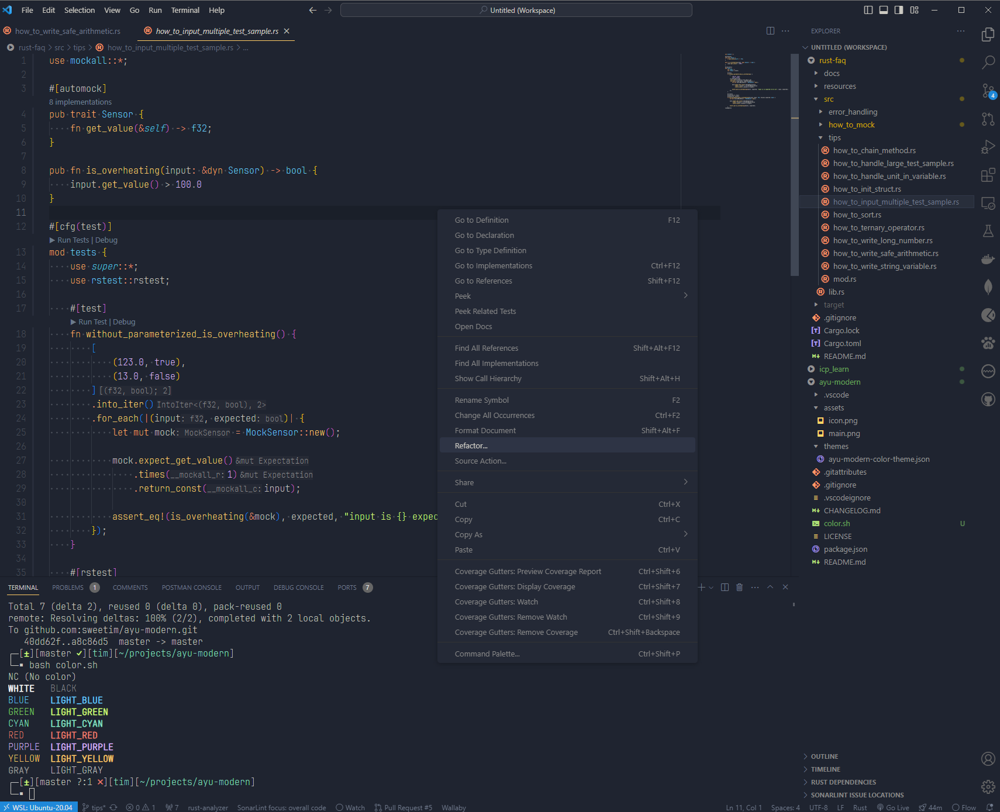

    <!-- <h3 align="center">
        
        Ayu Modern
    </h3> -->
    

        
        Ayu Modern
    

    
color theme that makes your eyes feel comfortable

this color theme is optimized for thin font like
[JetBrains Mono Font](https://www.jetbrains.com/lp/mono/) and `dark` mode only
